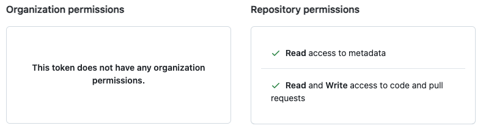

[](https://github.com/tagdots-dev/public201/actions/workflows/cron-coverage.yaml) [](https://github.com/tagdots-dev/public201/actions/workflows/cron-update-pre-commit.yaml)

# Update-Pre-Commit

## 😎 Why you need update-pre-commit?
If you are already using `pre-commit` or you are planning to use `pre-commit` to detect issues before code check-in and reduce the burden on code reviewers, **update-pre-commit** can compliment `pre-commit`.

**update-pre-commit** reads your project's `pre-commit` configuration file (`.pre-commit-config.yaml`), makes GitHub API call to get the latest update on each of the pre-commit hooks, and creates a pull request on **GitHub**.  You can use our `action` (coming soon) to run **update-pre-commit** and keep your `pre-commit` configuration up to date.

<br>

## 🪜 Prerequisites
```
* GitHub
  □ create an account.
  □ create a fine-grained personal access token with appropriate permissions.
  (see attachment below)

* Python (3.12+)
  □ install update-pre-commit.
```



<br>

## 🔆 Install update-pre-commit

In the examples below, we install **update-pre-commit** on a project named `hello-world` in a virtual environment named after the project.

```
~/work/hello-world $ workon hello-world
(hello-world) ~/work/hello-world $ export GH_TOKEN=github_pat_xxxxxxxxxxxxx
(hello-world) ~/work/hello-world $ pip install -U update-pre-commit
```

<br>

## 🔍 Using update-pre-commit

🏃 _**Run to show command line usage and options**_
```
(hello-world) ~/work/hello-world $ update-pre-commit --help

Usage: update-pre-commit [OPTIONS]

Options:
  --file TEXT        <file> (default: .pre-commit-config.yaml).
  --dry-run BOOLEAN  <true, false> (default: true).
  --version          Show the version and exit.
  --help             Show this message and exit.
```

<br>

🏃 _**Run to show version**_
```
(hello-world) ~/work/hello-world $ update-pre-commit --version
update-pre-commit, version 1.0.0
```

<br>

🏃 _**Run without any options**_

**update-pre-commit** implicitly runs with the option `--dry-run true` and does the following:
1. read the `.pre-commit-config.yaml`.
1. produce a list of out-of-date pre-commit hooks.

```
(hello-world) ~/work/hello-world $ update-pre-commit

Starting update-pre-commit on .pre-commit-config.yaml (dry-run True)...

hadolint/hadolint (v2.11.0) is not using the latest release rev (v2.12.0)
pycqa/flake8 (7.1.2) is not using the latest release tag (7.2.0)
antonbabenko/pre-commit-terraform (v1.98.0) is not using the latest release rev (v1.98.1)

Update revs in .pre-commit-config.yaml: None
```

<br>

🏃 _**Run with `--dry-run false` option**_

**update-pre-commit** runs with the option `--dry-run false` and does the following:
1. read the `.pre-commit-config.yaml`.
1. produce a list of out-of-date pre-commit hooks.
1. checkout a new git branch `update_pre_commit_01JV8P09N4G5K9Q4DDD533ARBH`.
1. update hooks rev inside `.pre-commit-config.yaml`.
1. create a pull request against repository default branch.

```
(hello-world) ~/work/hello-world $ update-pre-commit --dry-run false

Starting update-pre-commit on .pre-commit-config.yaml (dry-run False)...

hadolint/hadolint (v2.11.0) is not using the latest release rev (v2.12.0)
pycqa/flake8 (7.1.2) is not using the latest release tag (7.2.0)
antonbabenko/pre-commit-terraform (v1.98.0) is not using the latest release rev (v1.99.0)

Update revs in .pre-commit-config.yaml: Success

Checkout new branch successfully....

Push commits successfully:
from local branch: update_pre_commit_01JV8P09N4G5K9Q4DDD533ARBH
with commit hash : 7b293faf5e14f6950bf28b510eb8d8c8beff26fe

Creating a Pull Request as follows:
Owner/Repo.  : tagdots/hello-world
Title        : update pre-commit-config
Source Branch: tagdots:update_pre_commit_01JV8P09N4G5K9Q4DDD533ARBH
PR for Branch: main
Rev Variances: [{"owner_repo": "antonbabenko/pre-commit-terraform", "current_rev": "v1.98.1", "new_rev": "v1.99.0"}, {"owner_repo": "adrienverge/yamllint", "current_rev": "v1.37.0", "new_rev": "v1.37.1"}]

Created pull request #101 successfully: https://github.com/tagdots/hello-world/pull/101
```

<br>

## 😕  Troubleshooting

**Step 1 - Ensure the following**

```
* your project's .pre-commit-config.yaml file is valid.
* your GitHub fine-grained token has the write permissions to contents and pull requests.
* update-pre-commit can find the .pre-commit-config.yaml file at the root of YOUR project.
```

**Step 2 - Open an [issue][issues]**

<br>

## 🙏  Contributing

Pull requests and stars are always welcome.  For pull requests to be accepted on this project, you should follow [PEP8][pep8] when creating/updating Python codes.

See [Contributing](CONTRIBUTING.md)

<br>

## 📚 References

[Pre-Commit on Github](https://github.com/pre-commit/pre-commit-hooks)

[How to fork a repo](https://docs.github.com/en/pull-requests/collaborating-with-pull-requests/working-with-forks/fork-a-repo)

[Manage Github Token](https://docs.github.com/en/authentication/keeping-your-account-and-data-secure/managing-your-personal-access-tokens)

<br>

[issues]: https://github.com/tagdots/update-pre-commit/issues
[pep8]: https://google.github.io/styleguide/pyguide.html
